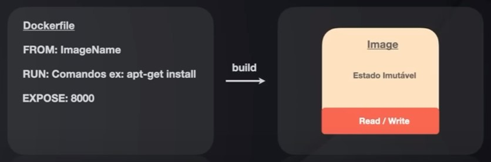

  

# Full Cycle Learning Experience

## Aula 01 Docker, Containers and Microservice of ChatGPT

- Entender o projeto prático
- Tecnologias que serão utilizadas
- Docker
- Início do Microsserviço

### Projeto Prático

- Desenvolveremos duas formas/interfaces para utilizarmos o CHatGPT:
  - Interface Web
  - WhatsApp

#### Dinâmica do Projeto

- Utilizaremos API do da OpenAI, para conseguirmos gerar a conversação com ChatGPT
- Criaremos um Microsserviço de chat (MS Chat)
- Construiremos um BackEnd, em NextJS, para se comunicar com o Chat MS. E também criaremos um FrontEnd para se comunicar com o BackEnd.

  - Assim o usuário utilizará o FrontEnd para chamar o BackEnd para chamar o ChatMS, através do gRPC, que irá consumir a API da OpenAI.

  - Também teremos interação do WhatsApp e do Twilio, o Twilio fornecera o número para ser utilizado no WhatsApp, assim o Twilio receberá a mensagem enviada para o WhatsApp, e chamará o Microsserviço Chat MS, através de uma requisição HTTP. Essa chama HTTP será uma chamada de WebHook.

  

### OpenAI API e ChatGPT

#### Tokens

- Tokens para o ChatGPT (ou qualquer modelo baseado na arquitetura GPT) são as unidades básicas de processamento de texto usadas pelo modelo durante o treinamento e a geração de respostas. Os tokens podem ser palavras, caracteres, ou sub-palavras, dependendo da língua e do "tokenizador" utilizado. Fonte: ChatGPT

  

#### Models

- Modelos para o ChatGPT são versões de modelos de linguagem treinados usando a arquitetura GPT (Generative Pre-trained Transformer) desenvolvida pela OpenAI. Eles são redes neurais profundas treinadas em grandes quantidades de texto para aprender a compreender a gerar texto humano coerente.

  

#### ChatGPT / API - Funcionamento básico

- Mensagem inicial do sistema (system)
- Pergunta do usuário (user)
- Resposta do ChatGPT (assistant)
- Pergunta do usuário (user)
- Resposta do ChatGPT (assistant)

- As Mensagens vão se acumulando para armazenar o contexto
- Quando não couber mais tokens, precisamos remover mensagens para a nova poder entrar, por isso quanto maior a quantidade de tokens, mais contexto será possível criar

#### Tokens e Contexto

- Segredo de tudo é fazer a contagem dos tokens.
- Sabendo quantos tokens estamos utilizando e a quantidade máxima do modele, podemos acumular mensagens.
- Quanto mais mensagens, melhor a resposta por conta do contexto das anteriores

### Microservice of Chat

#### Clean Architecture

  

###### Pontos Importantes

- O coração da aplicação dever ter suas regras de negócio consolidadas.
- O coração da aplicação não sabe que existe a API da OpenAI.
  - Não vê o use case, não vê o repositório, etc.
- Armazenar todas as conversações em um banco de dados.
  - todas vez que começar um novo chat, devemos armazená-lo no banco de dados, assim podemos, também, basearmos um novo chat com o contexto do chat armazenado em questão.
- O Usuário poderá informar seu 'user_id' como referência para ter acesso as conversas de um determinado usuário.
  - O 'user_id' será a referência para pegar a conversa.
- Servidor Web e gRPC para realizar as conversas.
- Precisaremos gerar um Token no site da OpenAI para termos acesso a API.
- A autenticação do nosso microsserviço também será realizada via eum token fixo em arquivo de configuração

### Tecnologias

- Docker
- Linguagem Go
- MySQL

#### Docker Básico Principal

  

##### Containers

- O que são containers?
  - Um container é um padrão de anidade de software que empacota código e todas as dependências de uma aplicação fazendo que a mesma seja executada rapidamente de forma confiável de um ambiente computacional para outro. Fonte: docker.com

###### Como funciona o docker

  

- Imagens do docker
  

- Dockerfile
  

- Construindo uma Imagem
  

